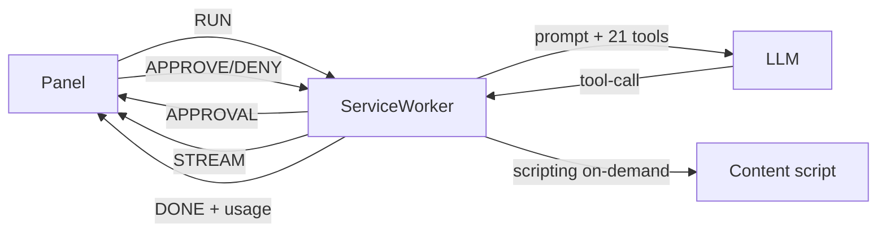

# lmuse — Guida al progetto

Estensione Chrome (Manifest V3) che fa usare il browser a un'AI per svolgere task e operazioni,
stile BrowserOS / Comet / Operator. Usi **la tua chiave LLM**: nessun server nostro, nessuna
telemetria, la chiave resta in `chrome.storage` sul tuo PC (dettagli in [PRIVACY.md](PRIVACY.md)).

**Stack:** TypeScript + Vercel AI SDK v7 (`ToolLoopAgent`) + React (side panel) + Vite + Vitest.
Base scelta dopo analisi: Nanobrowser (l'unica estensione open BYOK) è fermo da nov 2025,
BrowserOS è un fork di Chromium con licenza AGPL (non riutilizzabile per un prodotto),
Stagehand/Skyvern richiedono un backend. Quindi scaffold nuovo, con `reference/nanobrowser`
tenuto solo come riferimento per le idee (es. distillazione DOM).

## Provider supportati (13)

| Provider                                                                      | Note                                                       |
| ----------------------------------------------------------------------------- | ---------------------------------------------------------- |
| OpenAI, Anthropic, Google Gemini, xAI Grok, DeepSeek, Groq, Cerebras, Mistral | Package ufficiali AI SDK                                   |
| Azure OpenAI                                                                  | Richiede base URL risorsa + nome deployment come "modello" |
| OpenRouter                                                                    | Via OpenAI-compatibile, base URL precompilato              |
| Ollama, LM Studio                                                             | Locali, chiave opzionale, base URL precompilati            |
| Custom OpenAI-compatibile                                                     | Qualsiasi endpoint `/v1` (vLLM, Together, ecc.)            |

I nomi modello di default sono quelli correnti (set 2026), ma il campo modello è libero:
se esce un modello nuovo lo scrivi e funziona, senza aggiornare l'estensione.

## Struttura

```
public/manifest.json        Manifest MV3 (CSP, comandi tastiera, permessi, content script)
src/shared/settings.ts      Catalogo provider, settings, chiave/inbox/cronologia/usage, protocollo
src/shared/approval.ts      Policy approvazione, cooldown, plausibilità chiave (testato)
src/shared/header.ts        Intestazione snapshot redatta (testato)
src/shared/pii.ts           Redazione PII + token URL (testato)
src/shared/urlGuard.ts      Blocco protocolli/host + allowlist (testato)
src/shared/errors.ts        Errori provider → italiano (testato)
src/shared/budget.ts        Budget tool-call per run (testato)
src/shared/i18n.ts          Stringhe UI it/en
src/background/providers.ts Crea il modello AI SDK dal provider configurato
src/background/tools.ts     21 tool browser (snapshot, navigate, back/forward, reload,
                             click, type, select, wait, press, find, table, query,
                             scroll, screenshot×2, read_text, links, tabs×4)
                             con approval+budget/circuit/errori, inject on-demand
src/background/agent.ts     ToolLoopAgent in streaming + token-guard + system prompt
src/background/index.ts     Service worker: RUN/STOP, approval, stream, schedule, badge, inbox
src/content/snapshot.ts     Distilla il DOM in albero [ref] compatti (redatto)
src/content/index.ts        Esegue snapshot/click/digitazione/scroll su richiesta
src/sidepanel/              UI React: task, impostazioni, privacy, inbox, cronologia
sidepanel/index.html        Entry HTML (referrer no-referrer)
PRIVACY.md / SECURITY.md    Privacy e sicurezza documentate + audit
reference/nanobrowser/      Clone di riferimento (fuori git, opzionale):
                            `git clone https://github.com/nanobrowser/nanobrowser.git reference/nanobrowser`
```

## Flusso di un task



```
┌─────────┐  RUN(task)   ┌──────────────┐  prompt+21 tools ┌───────────┐
│  Panel  │ ──────────→ │ ServiceWorker │ ──────────────→ │   LLM     │
│  React  │ ←────────── │  (RUN/STOP,   │ ←────────────── │ (provider │
└─────────┘  STEP/DONE  │  approval,   │  tool-call      │  scelto)  │
  ↑ APPROVE/DENY        │  badge,usage) │                 └───────────┘
  │ (banner 120s)       └──────┬───────┘
  │ messaggi live              │ scripting on-demand + sendMessage (10s)
  │                            ↓
  │                     ┌──────────────┐
  └──────────────────── │Content script│ → snapshot / click / type / select /
     risultato          │ (isolated)   │   wait / press / read / links
     in inbox           └──────────────┘
```

Scrivi la richiesta → il worker avvia `ToolLoopAgent` → l'agente cicla
`snapshot → azione → osserva` (max passi default 25, budget tool = passi×3, circuit
breaker dopo 5 errori consecutivi) → vedi ogni tool in diretta → resoconto finale con passi · token · tempo. Se chiudi il pannello, il run
prosegue e il risultato ti aspetta nell'inbox. Lo screenshot va al modello come immagine
(disattivabile); se il modello non supporta le immagini, le impostazioni te lo segnalano.

Il content script è **iniettato on-demand**: nessuna iniezione all'apertura delle pagine,
solo `scripting.executeScript` sul tab attivo quando il task agisce davvero (e re-inject
automatico dopo le navigazioni). Su `chrome://`/Web Store l'inject è vietato da Chrome e
l'agente lo segnala.

## Approvazione umana (v0.3.0)

Policy in ⚙ → Privacy (`approval`): `off` · `sensitive` (default) · `all`.

```
┌────────┐  tool sensibile  ┌──────┐  APPROVAL   ┌───────┐
│ Tool   │ ───────────────→ │ SW   │ ──────────→ │ Panel │ banner + countdown 120s
│ (STOP) │ ←── abort ────── │      │ ←────────── │       │ Approva / Nega
└────────┘                  └──────┘  APPROVE/   └───────┘
                             ↓ DENY (zod)
                    deny/timeout → errore all'agente (cambia strategia)
```

- `sensitive`: conferma per navigazione verso domini nuovi nel run, invio form, cambio tab.
- Safety floor: l'invio di un form chiede conferma **anche con policy `off`**.
- `all`: conferma per ogni azione tranne snapshot ed elenco tab.
- Timeout 120s → negata; STOP sblocca subito anche un'attesa di conferma.
- Ogni decisione finisce nel log (approvato/negato + motivo).

## Domini fidati, template, preset (v0.4.0)

- Dal banner approval puoi spuntare "Ricorda questo dominio": le prossime navigazioni
  lì non chiederanno conferma (gestibili in ⚙, max 50).
- **Template**: salva il task corrente e riusalo con un click (max 20, solo locali).
- **Preset**: Veloce (12 passi, niente screenshot), Preciso (40 passi, retry alti),
  Locale (Ollama qwen3:8b).
- **Health-check**: "Prova connessione" in ⚙ fa una chiamata minima al provider e
  mostra OK o l'errore mappato in italiano.

## Streaming, stop-text, token-guard (v0.5.0)

- La risposta finale arriva **in streaming** nel pannello (bolla live tratteggiata,
  mai salvata: solo il testo finale finisce in inbox/log).
- **Stop-text** (⚙): se la pagina mostra quel testo, il run si chiude da solo con
  successo ("Task interrotto su tua condizione").
- **Token-guard** (⚙, default 60k): oltre soglia il run si interrompe con messaggio
  chiaro. Il contatore passi · token · tempo è in ogni resoconto.

## Task programmati (v0.5.0)

Programma il task corrente ogni N minuti (60–10080, max 5) da ⚙ o dall'area template.
`chrome.alarms` li fa partire anche a pannello chiuso: il risultato aspetta in inbox,
il badge ✓ segnala la fine. Senza panel le approval hanno timeout 20s e default negata
(mai auto-approve). "Cancella tutti i dati" cancella anche gli schedule.

## Cosa vede il modello

Per ogni passo: testo del task, snapshot testuale della pagina (URL, titolo, elementi
interattivi con ref), ed eventualmente screenshot PNG. **Di default redatto**: email,
IBAN, carte, telefoni/numeri lunghi e token negli URL compaiono come `[email]`, `[iban]`,
`[carta]`, `[numero]`, `[redatto]`; i campi password non compaiono mai (solo `[password]`).
Il modello non vede: la tua chiave API, le tue impostazioni, le altre schede (salvo
`tabs_list`/`tab_focus` espliciti), la cronologia dei task passati.

## Costi e token (v0.3.0)

Ogni run mostra `passi · token · tempo` nel resoconto; le statistiche cumulative (run e
token totali, nessun contenuto) sono in ⚙ in fondo. Per azzerare i costi: usa provider
locali (Ollama/LM Studio, gratis), modelli piccoli, `max passi` basso, screenshot OFF
quando non servono. "Cancella tutti i dati" azzera anche le statistiche.

## Sicurezza & Privacy (implementato, v0.3.0)

- MV3 con CSP `script-src 'self'`, nessuna risorsa esposta al web, niente `eval`/`innerHTML`.
- Permessi minimi (niente `debugger` → niente banner "Chrome è controllato"); Chrome ≥ 116.
- Port verificata (`sender.id`), messaggi validati con zod, task max 4000 caratteri.
- Navigazione bloccata verso `javascript:/data:/file:/chrome:*`/Web Store + allowlist domini.
- Chiave in storage separato (locale o solo-sessione), mai loggata, mai esportata.
- Budget tool-call, timeout 10s/risposta e globale, STOP anche da tastiera.
- v0.3.0: approval umana (default sensitive) + safety floor invio form, content script
  on-demand, header snapshot redatto, strip tracking params, no credenziali negli URL.
- Dettagli e audit: [SECURITY.md](SECURITY.md), [PRIVACY.md](PRIVACY.md).

## Impostazioni (tutte, con default)

| Chiave               | Default      | Note                                 |
| -------------------- | ------------ | ------------------------------------ |
| providerId / model   | openai/gpt…  | catalogo in `src/shared/settings.ts` |
| baseUrl              | ''           | Azure/custom/locali                  |
| maxSteps             | 25 (3–100)   | budget tool = maxSteps × 3           |
| maxRetries           | 2 (0–6)      | retry SDK su errori transienti       |
| runTimeoutMin        | 15 (1–120)   | timeout globale run                  |
| rememberKey          | true         | false = chiave solo in sessione      |
| privacyMaskPii       | true         | redazione snapshot (banner se OFF)   |
| privacyHidePasswords | true         | blocco digitazione password          |
| privacyHostOnly      | false        | solo origin+path, niente query       |
| keepHistory          | true         | false = nessuna persistenza task     |
| approval             | sensitive    | off / sensitive / all                |
| approvalTimeoutSec   | 120 (30–300) | timeout conferma → negata            |
| snapshotMaxChars     | 12000        | 4000–20000, taglio snapshot          |
| sendScreenshots      | true         | OFF = tool screenshot rifiutato      |
| allowedDomains       | ''           | CSV, vuoto = tutti                   |
| trustedDomains       | []           | max 50, niente conferma navigate     |
| savedPrompts         | []           | template task, max 20                |
| theme                | auto         | auto / dark / light                  |
| locale               | auto         | auto / it / en                       |
| maxTokensPerRun      | 60000        | 1000–200000, abort oltre soglia      |
| stopText             | ''           | chiude il run se appare nella pagina |
| soundOnDone          | false        | beep a fine task                     |
| compactLog           | false        | nasconde il chatter tool nel log     |
| lastRuns             | []           | ultimi 10 run (auto)                 |
| schedules            | []           | task programmati, max 5              |

## Comandi tastiera

| Scorciatoia                        | Azione         |
| ---------------------------------- | -------------- |
| `Ctrl/Cmd + Shift + L`             | Apri lmuse     |
| `Ctrl/Cmd + Shift + X`             | Ferma il task  |
| `Ctrl/Cmd + K` (nel panel)         | Focus sul task |
| `Invio` / `Shift+Invio` (nel task) | Avvia / a capo |

## Sviluppo

Requisiti: Node ≥ 22 (`nvm use 22`), pnpm 9.

```bash
pnpm install        # installa dipendenze
pnpm typecheck      # tsc --noEmit
pnpm test           # vitest (176 test)
pnpm test:coverage  # coverage v8 (soglie 85/85/80 su src/shared)
pnpm test:e2e        # smoke su Chromium reale (auto-scaricato in ~/.cache)
pnpm check-links     # link relativi nei .md
pnpm lint           # eslint flat
pnpm format         # prettier
pnpm check          # typecheck + test + lint + build
pnpm build          # compila in dist/
pnpm dev            # ricompila a ogni modifica (watch)
pnpm release        # check + verify-dist + zip di dist/ in release/
```

CI (GitHub Actions): verify (typecheck → coverage → lint → format → build →
verify-dist → size → links → audit → secret-scan) + job e2e separato
(Chromium + xvfb), a ogni push/PR.

**Caricare l'estensione in Chrome:**

1. `chrome://extensions` → attiva _Modalità sviluppatore_
2. _Carica estensione non pacchettizzata_ → seleziona la cartella `dist/`
3. Clicca l'icona lmuse (o `Ctrl/Cmd+Shift+L`) → pannello laterale
4. ⚙ → provider, modello, chiave API → scrivi un task e Avvia

## FAQ

- **Perché niente permesso `debugger`?** Il protocollo debugger mostra il banner "Chrome è
  controllato da un'estensione" e dà poteri enormi (rete, input raw). lmuse usa solo DOM +
  tab API: meno potente ma senza banner e con superficie minore.
- **Perché su `chrome://` o Web Store non funziona?** Chrome vieta i content script lì per
  policy; l'agente lo segnala con le cause possibili.
- **I miei dati vanno a Google/Chrome?** No: solo al provider LLM che configuri. Con
  Ollama/LM Studio restano sul tuo PC.
- **Il task continua se chiudo il pannello?** Sì, il run vive nel service worker; il
  risultato ti aspetta nell'inbox alla riapertura.
- **Posso fidarmi su siti con dati sensibili?** Usa redazione attiva (default), allowlist
  domini, provider locale; resta il rischio prompt-injection (vedi SECURITY.md).
- **L'agente chiede sempre conferma, come riduco le interruzioni?** Policy `off` (resta la
  conferma per l'invio form) oppure naviga tu per primo sui siti del task: i domini già
  visti nel run non richiedono conferma.
- **"Run interrotto (estensione riavviata)"?** Chrome ha ricaricato l'estensione mid-run
  (update/restart): premi Riprova, il task riparte da capo.
- **Il task fallisce subito con errore chiave?** Chiavi < 8 caratteri sono rifiutate:
  incolla la chiave completa in ⚙ (occhio agli spazi).
- **Pagina senza elementi / "prova screenshot"?** Siti Canvas/grafica non hanno DOM
  accessibile: usa lo screenshot e descrivi dove cliccare è impossibile — meglio un sito
  alternativo o task diverso.
- **"Troppi errori consecutivi"?** Il circuit breaker ha fermato il run dopo 5 tool
  falliti di fila: cambia pagina o riformula il task, poi Riprova.
- **Menu a tendina non selezionabile?** Usa `browser_select` (valore o testo opzione);
  se l'opzione manca, il tool elenca le disponibili.
- **Pagina che carica in ritardo?** `browser_wait` attende testo/selettore fino a 30s.
- **Tabella illeggibile?** `browser_table` la estrae in markdown; `browser_query`
  trova elementi con selettori CSS quando lo snapshot non basta.
- **Sito con shadow DOM?** Lo snapshot li attraversa da solo (bottone dentro
  web-component incluso).
- **Come riuso un task?** Salvalo come template (area cronologia) o copia il log intero
  dalla toolbar (filtro + download disponibili).
- **Lo streaming si è fermato ma il run continua?** Normale: il modello ragiona tra un
  tool e l'altro; la bolla live mostra solo il testo finale in arrivo.
- **Uno schedule non parte?** Controlla che sia attivo (●), che Chrome sia aperto
  (gli alarm richiedono il browser avviato) e che nessun altro run sia in corso.
- **Import profilo fallito?** Solo JSON ≤ 100KB esportati da lmuse; la chiave non è
  mai inclusa e va reinserita a mano.
- **"Limite token superato"?** Alza `maxTokensPerRun` in ⚙ o semplifica il task
  (meno passi, niente screenshot inutili, mode main per i testi).

## Roadmap

- [x] Cronologia task locale (max 20)
- [x] Approvazione umana per azioni sensibili
- [x] Test e2e smoke (resta: pubblicazione Chrome Web Store con listing definitivi)
- [ ] Streaming dei token nel pannello (oggi: eventi per tool + risposta finale)
- [ ] `optional_host_permissions` con consenso per-sito (alternativa a `<all_urls>`)
- [ ] Modalità senza chiave via Chrome Built-in AI (Prompt API, Gemini Nano locale)
- [ ] Offscreen document per task molto lunghi (il worker MV3 può addormentarsi)

## Stato onesto

`pnpm check` verde (typecheck + 199 test + lint + build), e2e smoke verde con a11y
su Chromium, coverage shared > 90%, Prettier verde, CI attiva.
Il giro completo con chiave reale va provato caricando `dist/` in Chrome: se un provider
cambia formato risposta, si aggiusta in `providers.ts`.
